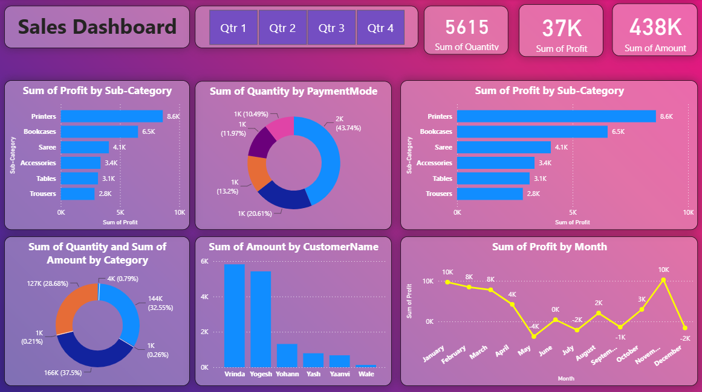

# Store-Sales-DashBoard
# 📊 Store Sales Dashboard

## 📌 Project Overview

The Store Sales Dashboard is an interactive Power BI report designed to analyze sales performance, profitability, customer behavior, and product trends. The dashboard provides a clear overview of key business metrics and helps identify top-performing products, customers, and payment methods.

---

## 🎯 Objective

The main objective of this dashboard is to monitor sales and profit performance, understand customer purchasing patterns, and support data-driven business decisions.

---

## 🛠️ Tools & Technologies

* Power BI Desktop
* Power Query
* DAX (Data Analysis Expressions)
* Data Modeling
* Data Visualization

---

## 📊 Dashboard Highlights

### Key KPIs

* **Total Quantity Sold:** 5,615
* **Total Profit:** 37K
* **Total Sales Amount:** 438K

### Visualizations Included

* 📈 Monthly Profit Trend Analysis
* 💰 Profit by Sub-Category
* 💳 Quantity by Payment Mode
* 🛍️ Sales & Quantity by Category
* 👥 Sales Amount by Customer
* 📅 Quarter-wise Sales Filtering

---

## 🔍 Key Insights

* **Printers** generated the highest profit (8.6K), followed by **Bookcases** (6.5K).
* Most purchases were made through a single dominant payment mode, contributing over 43% of total quantity sold.
* **Clothing and Electronics-related categories** contributed significantly to overall sales.
* **Vrinda** and **Yogesh** were the top customers by sales amount.
* Profit peaked in **January** and **November**, while losses were observed during some mid-year months.
* Total sales reached **438K** with an overall profit of **37K**.

---

## 💡 Business Value

This dashboard helps business owners and analysts:

* Track overall sales and profitability.
* Identify high-performing products and customers.
* Analyze customer payment preferences.
* Monitor monthly profit fluctuations.
* Support strategic sales and inventory decisions.

---

## 📷 Dashboard Preview

